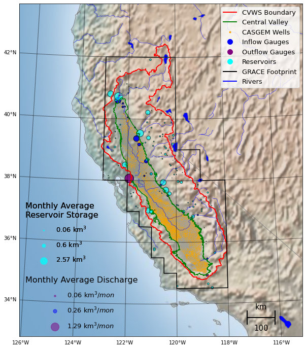
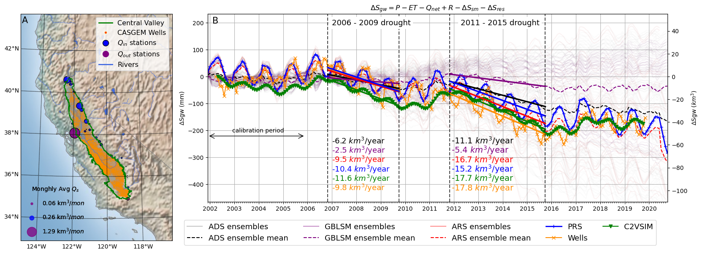

## Processing Codes accompanying the publication: 
### Ahamed, A., Knight, R., Alam, S., Pauloo, R., and Melton, F. (2021). Assessing the utility of remote sensing data to accurately estimate changes in groundwater storage. Science of The Total Environment,2021,150635,ISSN 0048-9697,https://doi.org/10.1016/j.scitotenv.2021.150635.

LICENSE: MIT

Permission is hereby granted, free of charge, to any person obtaining a copy of this software and associated documentation files (the "Software"), to deal in the Software without restriction, including without limitation the rights to use, copy, modify, merge, publish, distribute, sublicense, and/or sell copies of the Software, and to permit persons to whom the Software is furnished to do so, subject to the following conditions:

The above copyright notice and this permission notice shall be included in all copies or substantial portions of the Software.

THE SOFTWARE IS PROVIDED "AS IS", WITHOUT WARRANTY OF ANY KIND, EXPRESS OR IMPLIED, INCLUDING BUT NOT LIMITED TO THE WARRANTIES OF MERCHANTABILITY, FITNESS FOR A PARTICULAR PURPOSE AND NONINFRINGEMENT. IN NO EVENT SHALL THE AUTHORS OR COPYRIGHT HOLDERS BE LIABLE FOR ANY CLAIM, DAMAGES OR OTHER LIABILITY, WHETHER IN AN ACTION OF CONTRACT, TORT OR OTHERWISE, ARISING FROM, OUT OF OR IN CONNECTION WITH THE SOFTWARE OR THE USE OR OTHER DEALINGS IN THE SOFTWARE.

* Author: Aakash Ahamed (aahamed@stanford.edu), Stanford Univ Dept of Geophysics 
* Date: 7/2021
* Description: This repository contains the code and data to perform monthly water balance calculations using remote sensing and in situ data for the Central Valley (CV) and Central Valley Watershed (CVWS) of California. Files describing the geographic domain are stored in the `shape` directory. Scripts to download and process data, and generate figures and results are stored in the `code` directory. Instructions to install the required software dependencies are in the `build` directory. Figures and images are stored in the `images` directory. Below is a list of URLS containing additional datasets for the CV and CVWS. 

 <br>
Study domain

 <br>
Central Valley Results

# More information about data used or queried in this repository can be found in the manuscript text, Table 1, and in the references section of the paper. 

## Remote Sensing and Satellite Data - Various sources
[Google Earth Engine](https://developers.google.com/earth-engine/datasets/)

## SSEBOP ET data - USGS 
[SSEBOP](https://cida.usgs.gov/thredds/catalog.html?dataset=cida.usgs.gov/ssebopeta/monthly)

## Watershed Data - National Hydrographic Dataset - USGS
[https://www.usgs.gov/core-science-systems/ngp/national-hydrography/nhdplus-high-resolution](https://www.usgs.gov/core-science-systems/ngp/national-hydrography/nhdplus-high-resolution)
```
mkdir nhd
cd nhd

curl -o 1802.zip https://prd-tnm.s3.amazonaws.com/StagedProducts/Hydrography/NHD/HU4/HighResolution/Shape/NHD_H_1802_HU4_Shape.zip && mkdir 1802 && tar -xvf 1802.zip && mv Shape/ 1802/ && rm 1802.zip

curl -o 1803.zip https://prd-tnm.s3.amazonaws.com/StagedProducts/Hydrography/NHD/HU4/HighResolution/Shape/NHD_H_1803_HU4_Shape.zip && mkdir 1803 && tar -xvf 1803.zip && mv Shape/ 1803/ && rm 1803.zip

curl -o 1804.zip https://prd-tnm.s3.amazonaws.com/StagedProducts/Hydrography/NHD/HU4/HighResolution/Shape/NHD_H_1804_HU4_Shape.zip && mkdir 1804 && tar -xvf 1804.zip && mv Shape/ 1804/ && rm 1804.zip

```

## C2VSIM flow model - DWR

click link to download:

[https://minhaskamal.github.io/DownGit/#/home?url=https://github.com/richpauloo/pred_gws/tree/master/data/C2VSimFG-BETA_GIS/Shapefiles](https://minhaskamal.github.io/DownGit/#/home?url=https://github.com/richpauloo/pred_gws/tree/master/data/C2VSimFG-BETA_GIS/Shapefiles)

```
mkdir c2vsim
cd c2vsim

mv ~/Downloads/Shapefiles.zip .
tar -xvf Shapfiles.zip
cd Shapefiles
mv * ..
rm -rf Shapefiles Shapefiles.zip

```

## Crop Coefficients - USGS
[https://water.usgs.gov/GIS/dsdl/pp1766_fmp_parameters.zip](https://water.usgs.gov/GIS/dsdl/pp1766_fmp_parameters.zip)

## SF Bay Outflow - DWR
[dayflow](https://water.ca.gov/Programs/Environmental-Services/Compliance-Monitoring-And-Assessment/Dayflow-Data)

## Well data - DWR Casgem 
[casgem](https://data.cnra.ca.gov/dataset/periodic-groundwater-level-measurements)

## Reservoir Data - California Data Exchange Center
[http://cdec.water.ca.gov/misc/monthlyStations.html](http://cdec.water.ca.gov/misc/monthlyStations.html) 

## Streamflow Data - USGS 